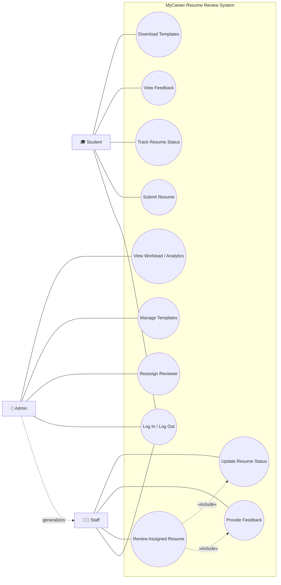
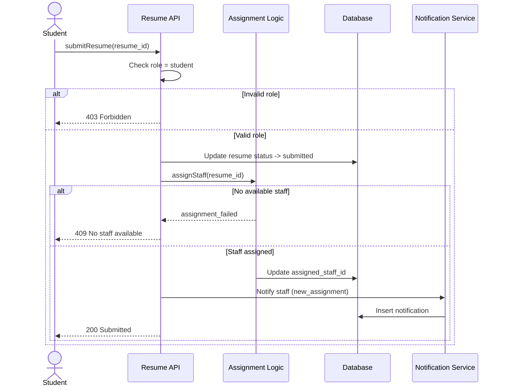
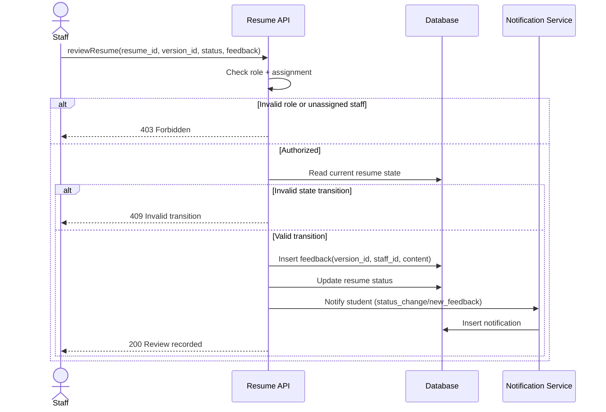
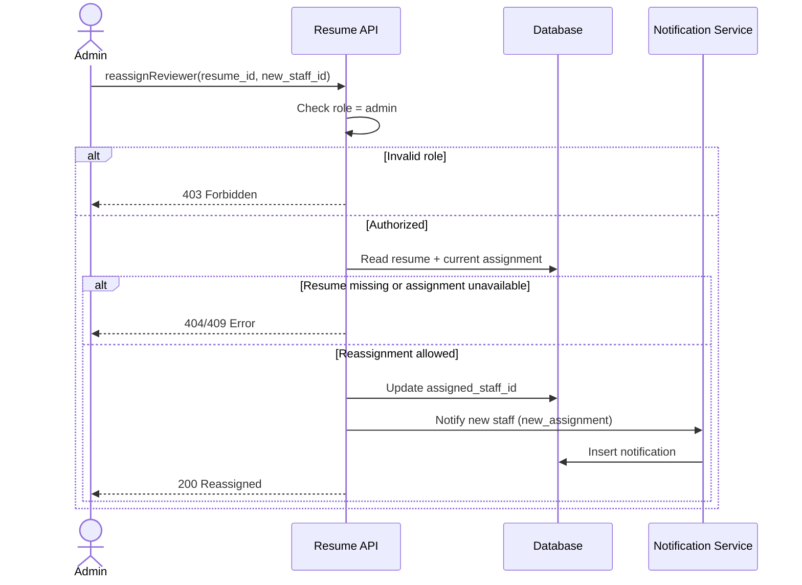
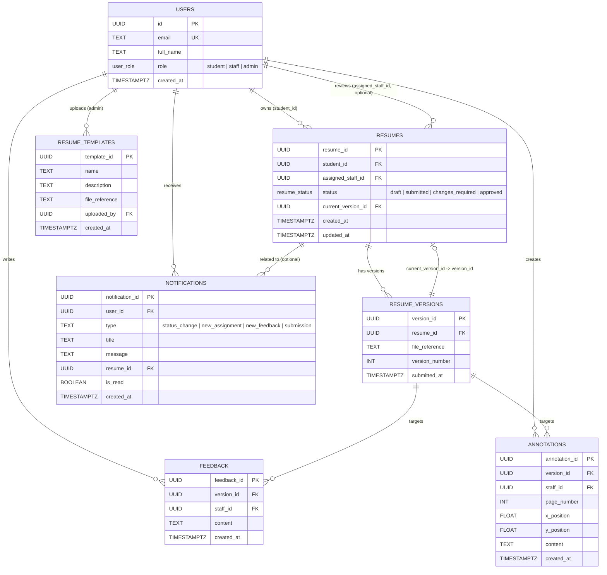

# MyCareer Platform — UML Diagrams

## Use Case Diagram

---

## Sequence Diagrams

### 1) Resume Submission

### 2) Resume Review

### 3) Admin Reassignment

---

## Entity-Relationship Diagram

---

## Diagram Legend

- `||` = exactly one
- `o|` = zero or one
- `o{` = zero or many
- `|{` = one or many
- Enum fields are shown inline in quotes (for example `status`, `role`, and `notification type`)
- Constraint note: `RESUMES.current_version_id`, when present, must reference a `RESUME_VERSIONS.version_id` row for the same `resume_id`

---

## Key Relationships Summary

| Relationship | Cardinality | Description |
|---|---|---|
| User → Resumes (student) | 1 : many | A student owns multiple resumes |
| User → Resumes (staff assignment) | 1 : many, optional per resume | A staff member can be assigned many resumes; a resume may be temporarily unassigned |
| Resume → Versions | 1 : many | Each resume has multiple file versions |
| Resume → current_version | 0..1 : 1 | `current_version_id` points to exactly one version when set |
| Version → Feedback | 1 : many | Staff leave multiple feedback items per version |
| Version → Annotations | 1 : many | Staff place multiple annotations per version |
| User → Notifications | 1 : many | Each user receives multiple notifications |
| User → Templates (admin) | 1 : many | Admin uploads multiple templates |
| Resume → Notifications | 1 : many (optional context) | Notifications may optionally reference a resume |
