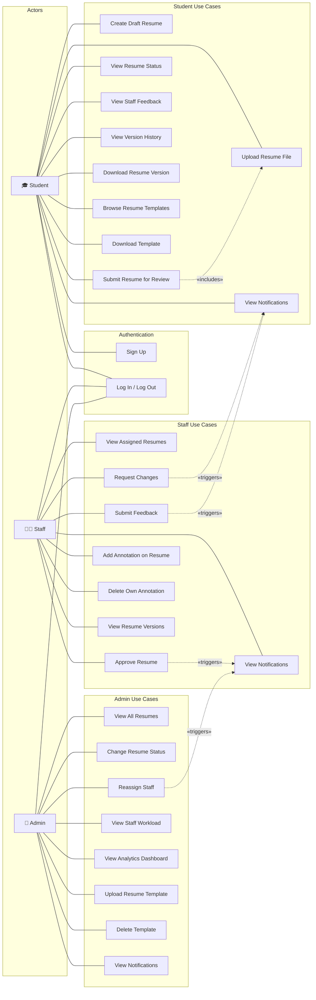
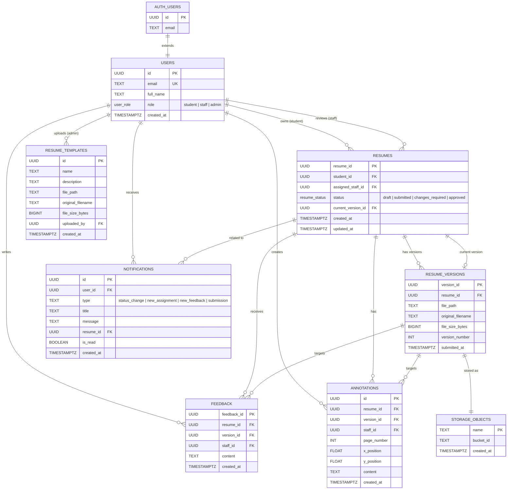

# MyCareer Platform — UML Diagrams

## Use Case Diagram

---

## Entity-Relationship Diagram

---

## Key Relationships Summary

| Relationship | Cardinality | Description |
|---|---|---|
| User → Resumes (student) | 1 : many | A student owns multiple resumes |
| User → Resumes (staff) | 1 : many | A staff member is assigned multiple resumes |
| Resume → Versions | 1 : many | Each resume has multiple file versions |
| Resume → current_version | 1 : 0..1 | Points to the latest uploaded version |
| Resume → Feedback | 1 : many | Staff leave multiple feedback items |
| Resume → Annotations | 1 : many | Staff place multiple annotations |
| User → Notifications | 1 : many | Each user receives multiple notifications |
| User → Templates (admin) | 1 : many | Admin uploads multiple templates |
| Version → Storage | 1 : 1 | Each version maps to a file in storage |
